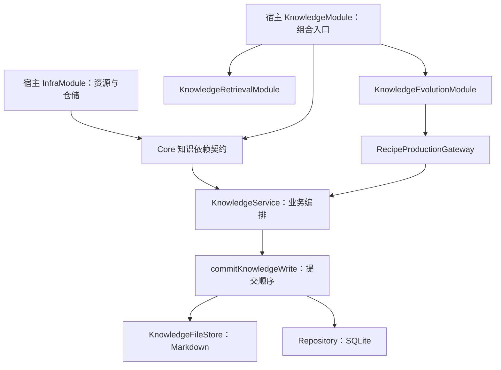

# 知识接口与宿主装配

知识用例接收能力契约，宿主提供实现并管理资源。API 参数校验、业务编排、文件策略、数据库映射和工具返回投影各有明确归属。

## Core 文件职责

| 文件 | 职责 |
| --- | --- |
| `service/knowledge/KnowledgeServiceDependencies.ts` | 知识服务的仓储、文件、graph、routing、hooks、scoring 等依赖契约与 options |
| `service/knowledge/KnowledgeService.ts` | CRUD、生命周期、审计、事件和关系维护的业务顺序 |
| `service/knowledge/KnowledgeUpdateSchema.ts` | 编辑入口的 retrievalProfile wire 结构；不代替生产准入和 active readiness |
| `service/knowledge/projectKnowledgeQualityFields.ts` | 创建前路由与质量重算共用的纯字段投影 |
| `service/knowledge/commitKnowledgeWrite.ts` | 文件优先的单条异步提交及分歧归类 |
| `service/knowledge/persistKnowledgeUpdate.ts` | 按 id 准备完整实体，再调用同一提交边界 |
| `repository/knowledge/KnowledgeFileStore.ts` | 文件写能力契约；序列化/命名/搬移策略仍由 KnowledgeFileWriter 实现 |
| `repository/knowledge/KnowledgeRepositoryImpl.ts` | SQLite 行映射、查询、SQL/FK 约束和真实仓储实现 |
| `service/knowledge/RecipeProductionGateway.ts` | 生产入口的验证、去重、准入与已持久化结果协调 |

通过 `@alembic/core/knowledge` 导入 `KnowledgeServiceOptions` 和 `KnowledgeServiceRepository`。宿主工厂以 `satisfies KnowledgeServiceOptions` 检查依赖，真实 repository / writer / graph 对象直接传入，不需要重新包装或把整个 options 强转。

`KnowledgeServiceRepository` 保留既有仓储查询能力，明确 create/update 的真实可空读回。两个旧名称保持兼容：`@alembic/core/knowledge` 的 KnowledgeRepository 仍是原 runtime 类，`@alembic/core/repositories` 的同名类型仍指实际实现。新服务依赖类型不与二者混名。

## 两宿主模块职责

| 模块 | 提供内容 |
| --- | --- |
| InfraModule | 数据库与仓储 bundle、文件 writer、审计等资源；Main 的 warning/lifecycleEvent 仓储也在这里注册 |
| KnowledgeModule | 知识服务、graph、routing 和共享服务；保持原组合入口与初始化订阅 |
| KnowledgeRetrievalModule | SearchEngine、向量存储/代际资源、索引管线及 hybrid retriever 的惰性工厂 |
| KnowledgeEvolutionModule | source refs、staging、decay、提案、生产 gateway，以及各宿主原有的维护能力 |
| VectorModule | VectorService、embedding 准备与既有异步就绪步骤 |

KnowledgeModule 的组合顺序为基础知识服务 → retrieval 注册 → shared 注册 → evolution 注册。register 只注册工厂；不能提前取出尚未完成装配的 vectorService。initializeKnowledgeServices 保持原调用时机，Plugin 的 proposal 订阅仍在 eventBus/searchEngine 缺席分支之前。

Main 的动态 source identity、AI 依赖标记、file-change 能力，以及 Plugin 的 generation 缓存、embedding similarity、freshness 和订阅策略各自保留。模块拆分不统一这些业务策略。

## 可空返回与兼容行为

KnowledgeService.update、生命周期操作及 RecipeProductionPort.publish 明确返回实体/记录或 null。原 DB-only 运行时行为保持；类型消费者必须承认可空结果，不能用非空断言或整个依赖包的强转掩盖它。

| 情况 | 行为 |
| --- | --- |
| file-first 写入的读回缺失或 id 不符 | 原协调器抛 DivergenceError，已落盘 Markdown 保留供恢复 |
| DB-only update/transition，未投影成功事件 | 原样返回 null，保留原审计与 afterPublish 时机 |
| DB-only create 或成功事件需要解引用空实体 | 在原 id/toJSON 投影位置保留 TypeError，不提前改变写入流程 |
| Gateway 的关系补写返回 null | created.raw 原样为 null，不回退旧实体、不增加伪造的成功内容 |
| Agent publish 读到 null | 保留写入已开始后的失败分类，要求读回确认 |

CreatedRecipeInfo.raw 是原始对象或 null，实际对象可以是带方法的 KnowledgeEntry。Gateway 不克隆或序列化它；展示层只读取所需字段。严格 prepared/admission 的 recipe 仍为经过检查的非空记录，普通 publish 的可空类型不放松严格事实门。

其他边界同样保持：查询到的非空 SQLite 行一定映射为实体；空输入的旧 `_rowToEntity(null)` 仍返回 null；空表统计的 SUM 仍为 null。通用 SkillHooks.run 返回 unknown，提交入口仅按原 JavaScript 属性读取语义消费 truthy block/reason，创建后的异步通知不解释返回值。

SearchEngine 接收 raw SearchDb 或提供 getDb() 的句柄。解包由 Core 仓储适配器完成，宿主装配不必调用低层 getDb，也不必让 DatabaseConnection 伪装成同时具备 prepare 的对象。
